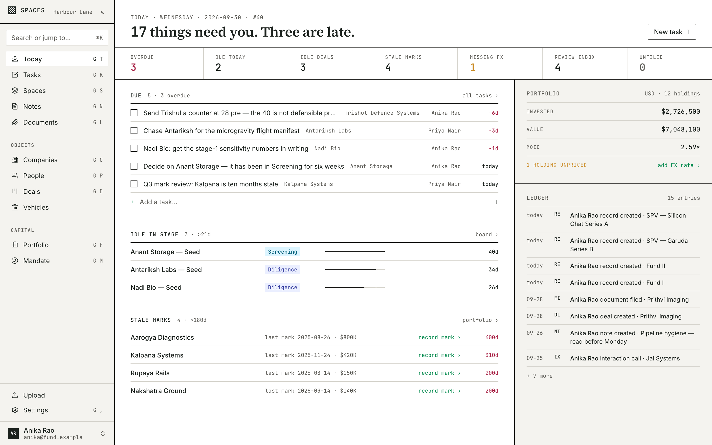
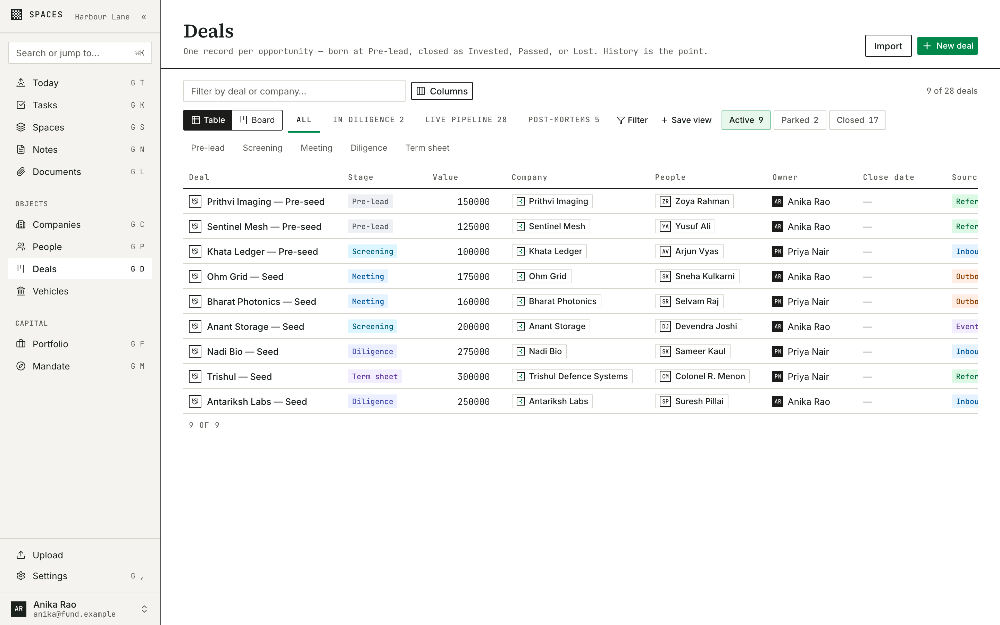
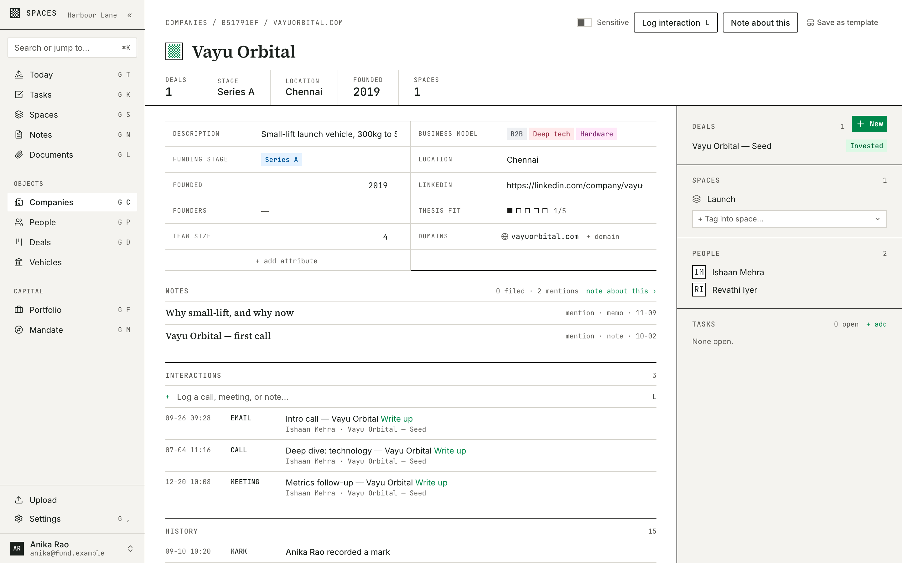
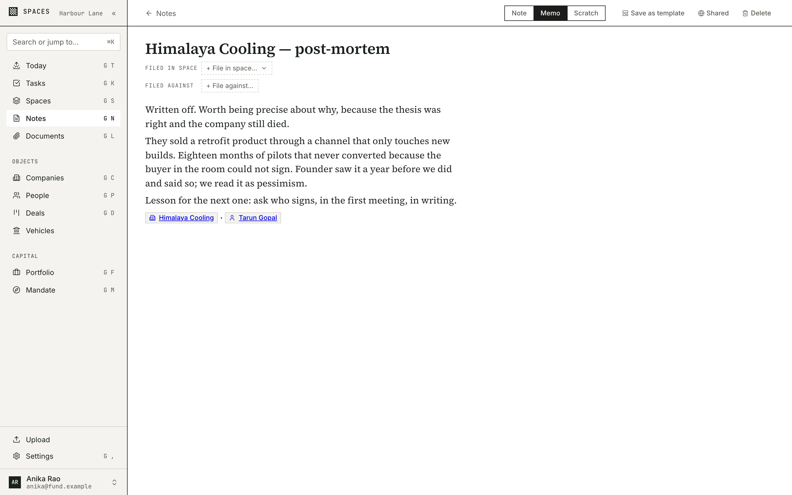
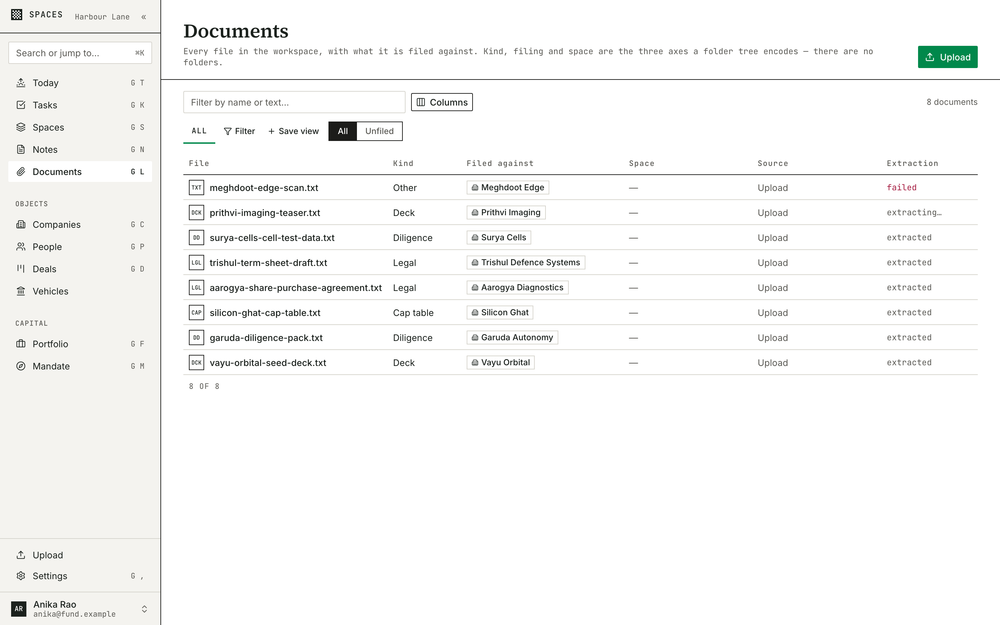
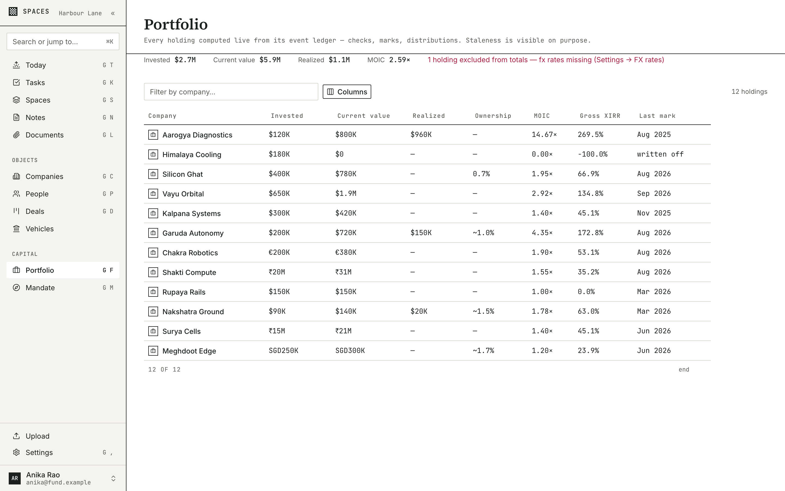
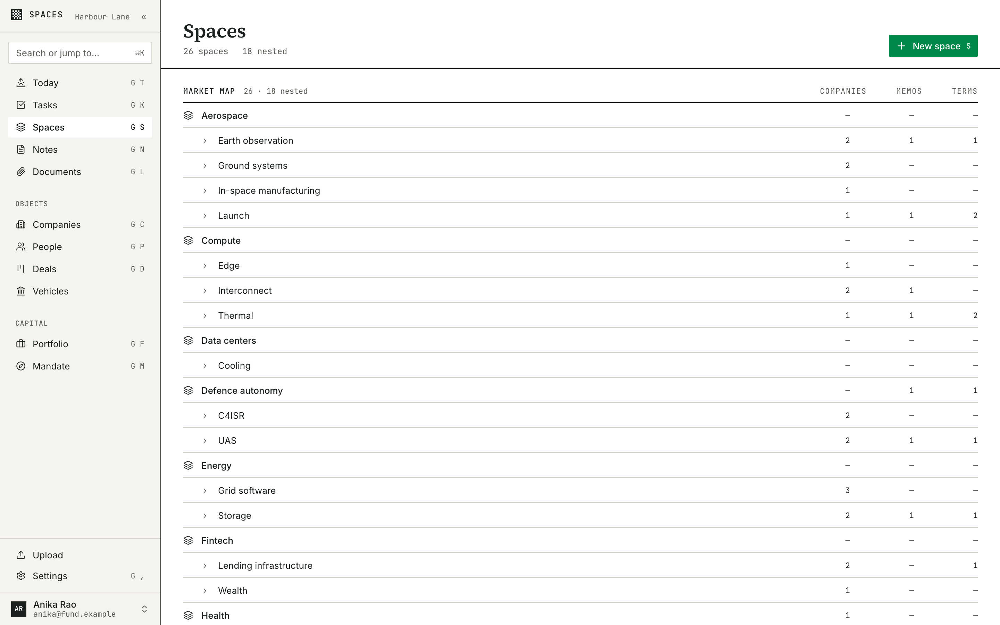
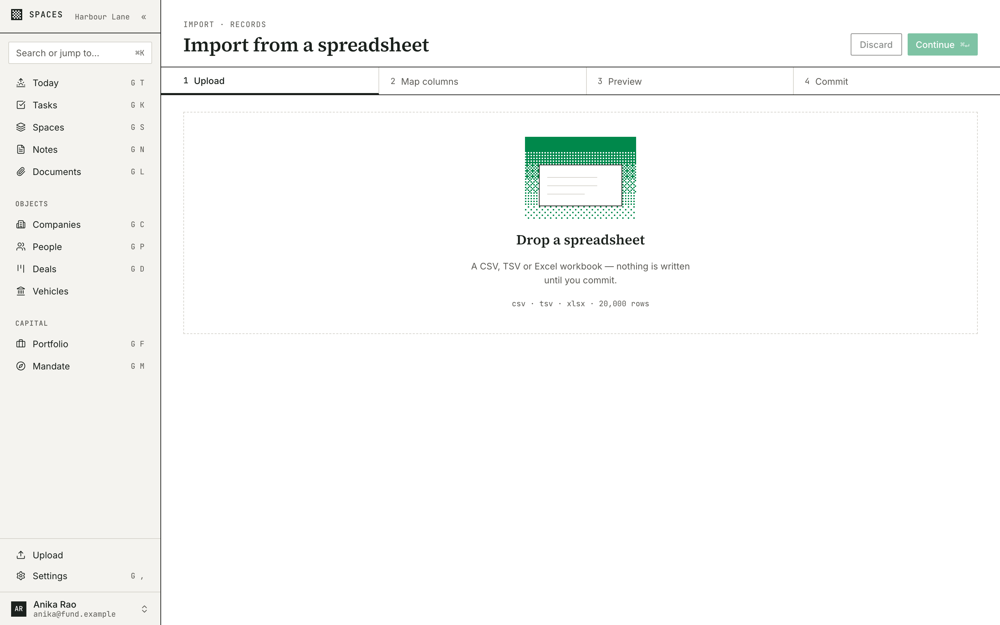
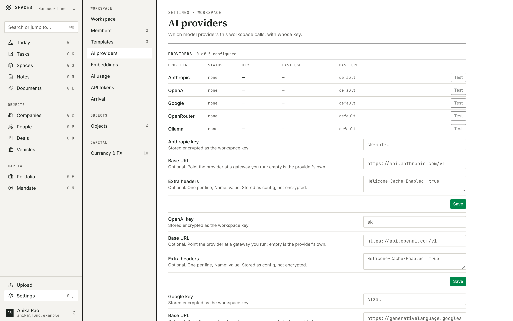

<p align="center">
  <picture>
    <source media="(prefers-color-scheme: dark)" srcset="docs/assets/logo-dark.svg">
    
  </picture>
</p>

<p align="center">
  <strong>The deal book you run yourself.</strong><br>
  Self-hosted deal management for angel and private-capital investing.
</p>

<p align="center">
  <a href="https://github.com/AnishxBadri/Spaces/actions/workflows/ci.yml"></a>
  <a href="https://github.com/AnishxBadri/Spaces/actions/workflows/release.yml"></a>
  <a href="https://github.com/AnishxBadri/Spaces/pkgs/container/spaces"></a>
  <a href="LICENSE"></a>
</p>

<p align="center">
  <a href="#self-hosting">Self-host</a> ·
  <a href="#what-you-get">Features</a> ·
  <a href="#bring-your-own-keys">BYOK AI</a> ·
  <a href="#whats-next">Roadmap</a> ·
  <a href="docs/ARCHITECTURE.md">Architecture</a> ·
  <a href="CONTRIBUTING.md">Contributing</a>
</p>

<p align="center">
  
</p>

---

Spaces is an open-source, self-hosted deal-management OS for angels and small
funds. Think Affinity or TagHash, except you run it, you own the data, and
every AI or data provider is bring-your-own-key. It is not a horizontal CRM.
It is opinionated for investors, and that constraint is the product.

Two halves sit on one graph:

- **Research** — spaces, notes, sources, a glossary. Slow, exploratory, no
  pipeline. Your market map, compounding.
- **Deals** — companies, people, deals, activity, a portfolio ledger. Fast,
  structured, spreadsheet-grade.

The seam is the point: a company entering the pipeline already carries the
months of research you filed on it. Everything stays on your box. Nothing
phones home.

## Why self-host

- **Funds do not put deal terms, decks and cap tables in someone else's SaaS.**
  Two containers on a box you control, one `./data` directory to back up.
- **Confidential decks never leave the building.** Point the AI at a local
  Ollama and deep-tech or defence material stays off third-party APIs.
- **Provider terms sit between you and the provider.** Enrichment and AI keys
  are yours; Spaces holds them encrypted and never proxies them.
- **Open schema, no lock-in.** Postgres you can query, blobs you can copy,
  AGPL-3.0 so it stays that way.

## What you get

### Pipeline and deals

A deal is a first-class object born from a deck, screened against your
mandate, moved through stages that keep their history. Pass and lost are
remembered, so the same company coming back next year lands on what you
thought last time.



### Records that speak investing

Companies and people are seeded with the attributes an investor actually
tracks (stage, round, geography, sector), and every object takes custom
attributes with validation, change history and reference links. Duplicates
are found by fuzzy name, domain and LinkedIn and merged without losing a row.



### Notes with context

Notion-grade block notes, filed against companies, people, deals or spaces.
A note can be private to you. Mention a company and the assembler pulls the
right context, cited, into anything the AI drafts.



### Documents and search

Drop a deck, a memo, a data-room export. The worker extracts the text, the
database indexes it (lexical, fuzzy and vector, all in Postgres), and a
company's Files tab previews it without fetching anything off-origin.



### A portfolio ledger an auditor would recognise

Investments, marks, distributions and FX rates are append-only events. A
correction is a compensating event, never an edit. Ownership, cost, value,
MOIC and IRR are computed live from the ledger as of any date.



### Spaces: a taxonomy you own

A hierarchy of sectors and theses that companies, notes and glossary terms
file into. The starter taxonomy is deliberately tiny. Yours grows with the
research.



### Import from a spreadsheet

Map the columns once, preview what would land, commit. A re-run of the same
file writes nothing.



## Bring your own keys

Every provider is configured in the app under **Settings → AI**, stored
encrypted with a master key that lives only on your disk, and never leaves
your deployment as anything but a request you chose to make.

| Lane       | Providers                                     | Notes                                                      |
| ---------- | --------------------------------------------- | ---------------------------------------------------------- |
| Language   | Anthropic, OpenAI, Google, OpenRouter, Ollama | routed by lane and sensitivity; local-only lanes for decks |
| Embeddings | OpenAI, Google, Voyage, Ollama                | pinned to one dimension per deployment; re-embed is a job  |
| Enrichment | Apollo (in progress, via the plugin SDK)      | provider terms are between you and the provider            |

AI writes are suggestions. Nothing the model produces lands on a record until
you accept it.



## Self-hosting

Two containers, two volumes, one command. The image is multi-arch
(`linux/amd64`, `linux/arm64`), published to GHCR and Docker Hub on every
release, signed with cosign, and pinned by tag. There is no `latest`.

### Requirements

- Docker with Compose v2
- A small VPS or a box under the desk, `amd64` or `arm64`.
- A domain, if you want HTTPS. Optional.

### First run

```bash
mkdir spaces && cd spaces
curl -fsSLO https://raw.githubusercontent.com/AnishxBadri/Spaces/main/docker-compose.yml
docker compose up -d
docker compose logs app | grep "setup token"
```

Open `http://localhost:3000/setup`, paste the token, create the admin. The
setup window closes the moment the first admin exists. Login lands on
`/today`.

Everything the app owns is in `./data` (blobs, the auto-generated
`secret.key`) and the `spaces_pgdata` volume.

### HTTPS

The app never terminates TLS. A reverse proxy sits in front, and `APP_URL`
is the single source of truth for scheme, cookies and every external link.
Caddy is the worked example, shipped as an overlay. It needs two more
files beside the compose file:

```bash
curl -fsSLO https://raw.githubusercontent.com/AnishxBadri/Spaces/main/docker-compose.tls.yml
curl -fsSL --create-dirs -o docker/Caddyfile https://raw.githubusercontent.com/AnishxBadri/Spaces/main/docker/Caddyfile

SPACES_DOMAIN=deals.example.com \
APP_URL=https://deals.example.com \
docker compose -f docker-compose.yml -f docker-compose.tls.yml up -d
```

Point an A/AAAA record at the box and open 80 and 443. Port 80 carries the
ACME challenge and the redirect. Caddy issues and renews on its own, and the
overlay stops publishing 3000 on the host.

Any other proxy needs exactly two things: a correct `APP_URL`, and a proxy
that speaks plain HTTP to the app container on 3000. The app reads no
forwarded headers at all, so a spoofed header cannot change a link, a cookie
or a redirect.

> **The one trap.** An `http://` `APP_URL` behind an `https://` proxy fails
> silently: the session cookie is set without `Secure`, the browser drops it,
> and you land back on the login page with no error. Set `APP_URL` to the
> scheme and host the **browser** sees. Boot warns loudly when it looks wrong.

### Environment

Only two values are required. Everything else is optional and set from the
app.

| Variable         | Required | Purpose                                                                                                                                     |
| ---------------- | -------- | ------------------------------------------------------------------------------------------------------------------------------------------- |
| `DATABASE_URL`   | yes      | Postgres 17 with pgvector. The compose file provides one.                                                                                   |
| `APP_URL`        | yes      | The origin the browser sees, e.g. `https://deals.example.com`.                                                                              |
| `MASTER_KEY`     | no       | Encrypts stored credentials. Auto-generated to `/data/secret.key`.                                                                          |
| `STORAGE_DRIVER` | no       | `local` (default) or `s3`, then `S3_BUCKET`, `S3_ENDPOINT`, `S3_REGION`, `S3_ACCESS_KEY_ID`, `S3_SECRET_ACCESS_KEY`, `S3_FORCE_PATH_STYLE`. |

`STORAGE_DRIVER=s3` with R2 or B2 is how ephemeral-disk platforms (Fly,
Railway, Render) run it.

### Backup and restore

The database and `./data` are worthless apart: blobs are content-addressed
files with no filenames, and the rows that name them live in Postgres. The
scripts treat the pair as one unit and refuse to produce half.

```bash
./scripts/backup.sh                 # → ./backups/<timestamp>/  (pg_dump + data.tar), or nothing
./scripts/restore.sh backups/<dir>  # stages both halves, swaps only when both loaded
```

**Losing `secret.key` loses every stored credential.** Back up `./data`
with the dump, every time. Cron `0 3 * * *` is a fine default.

### Upgrading

Back up, then change the image tag in `docker-compose.yml` on purpose and
`docker compose up -d`. Migrations are forward-only and run on boot. Rollback
is a restore, never an older image on a newer schema: the boot guard refuses
to start an image older than the schema it finds.

Each release is `core@X.Y.Z` on GitHub. Both registries carry `X.Y.Z` and
`X.Y`. GHCR also carries SLSA provenance, so you can verify what you run:

```bash
cosign verify ghcr.io/anishxbadri/spaces:0.1.0 \
  --certificate-identity-regexp 'github.com/AnishxBadri/Spaces' \
  --certificate-oidc-issuer https://token.actions.githubusercontent.com
```

### Scaling out and checking health

The shipped compose runs one `ROLE=all` container. To split the web server
from the worker, overlay `docker-compose.split.yml`. The two halves talk only
through Postgres.

`GET /api/health` is unauthenticated and thin: a status, the database, and
how long ago the worker last beat.

```json
{
  "status": "ok",
  "db": "ok",
  "worker": { "status": "ok", "lastBeatSeconds": 7 }
}
```

A stale worker never fails the web container's healthcheck. Only an
unreachable database answers 503. A `ROLE=worker` container's own
healthcheck reads its heartbeat row, so `docker ps` shows it `unhealthy`
within a minute of the process dying.

### Local models

```bash
docker compose --profile ollama up -d
docker compose exec ollama ollama pull nomic-embed-text
```

Then save Ollama at `http://ollama:11434` under Settings → AI → Providers.

## What's next

Shipped: everything above, on the entity graph, the attribute engine, the
context assembler and the Effect-first backend. In progress, in order:

- **Plugin SDK** — `@spaces/sdk`. Integrations install from the running app
  into `./data/plugins`, run only on the worker, and feed the graph through
  typed claim lanes. They never extend the product.
- **Enrichment** — Apollo first, with a daily credit cap and a 90-day cache.
- **Mail and calendar** — Gmail and Google Calendar as forward-only syncers,
  with the privacy default decided before the second partner connects.
- **Storage sources** — Drive and Box on one read port. A bound data room.
- **Researcher lane** — Exa, budgeted and attributed, proposing never writing.

The full sequence, with every decision and its options, is in
[`docs/roadmap-2026-09.md`](docs/roadmap-2026-09.md). Not on the list: LP
reporting, fund administration, a hosted SaaS. Different product, different
buyer.

## How it's built

```
Browser (React) ── typed server functions ──┐
                                            ├── Postgres 17 · data, jobs, search, vectors
Worker (pg-boss · extraction · AI jobs) ────┘
                                            └── ./data · blobs (local | S3) · secret.key
```

TanStack Start and React 19 on the front; Effect on the back; Postgres 17 as
the one stateful service (Drizzle, pg-boss, tsvector and pg_trgm, ltree,
pgvector); Better Auth; BlockNote; TanStack Table. The monorepo is pnpm and
Turborepo: `apps/web`, `apps/worker`, `apps/e2e`, `apps/site`, `packages/db`,
`packages/core`, `packages/config`, with `packages/sdk` and `plugins/*`
arriving with the SDK.

- [`docs/ARCHITECTURE.md`](docs/ARCHITECTURE.md) — every model, the stack,
  the roadmap, in one read
- [`CONTEXT.md`](CONTEXT.md) — the decision record, dated
- [`docs/CODEBASE.md`](docs/CODEBASE.md) — where things live
- [`CONTRIBUTING.md`](CONTRIBUTING.md) — dev setup, the gates, how to pick
  up an issue

## Developing

```bash
pnpm install
docker compose -f docker-compose.dev.yml up -d   # Postgres :5432 + MinIO :9000
cp .env.example .env.local                        # DATABASE_URL, BETTER_AUTH_SECRET
pnpm db:migrate:run
pnpm dev                                          # http://localhost:3000, worker in watch
pnpm db:seed                                      # an invented fund's book, after /setup
```

Gates: `pnpm typecheck`, `pnpm test`, `pnpm lint`, prettier. All four must be
green before a commit. `pnpm e2e` drives the built app in Chromium and
`pnpm screenshots` regenerates the images in this file. Details in
[`CONTRIBUTING.md`](CONTRIBUTING.md).

## License

[AGPL-3.0](LICENSE). Run it, change it, ship it; if you serve a modified
version to others, share the changes.
